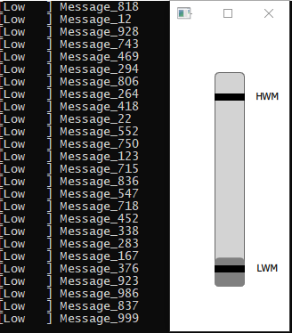

<b>MessageQueue</b> - блокирующая очередь с приоритетами, заданного размера. Обеспечивает обмен сообщениями между несколькими потоками «писателей» и «читателей», поддерживает механизм HWM/LWM (по умолчанию 10%/90% соответственно). Содержит блокирующий вызов get.

Демонстрация работы приложения. Вывод сообщений в консоль. Отображение состояния очереди. (Границы LWM/HWM можно изменять)

  

